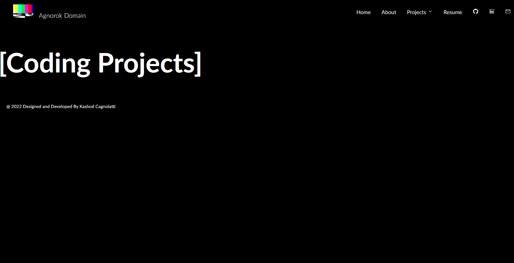
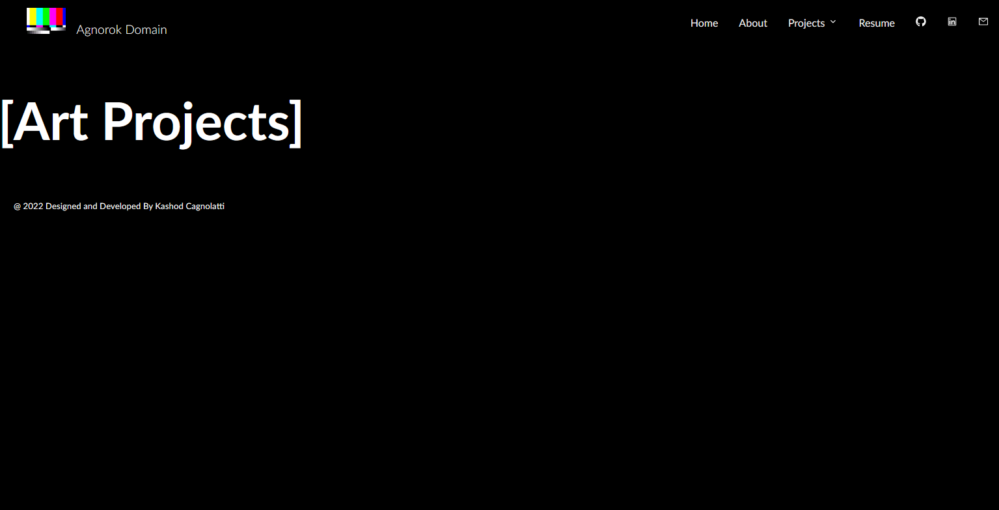
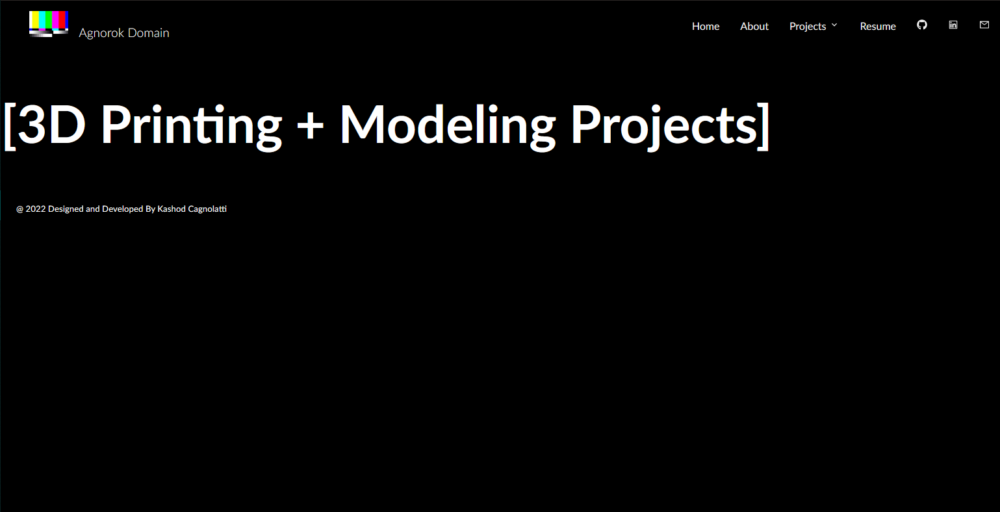
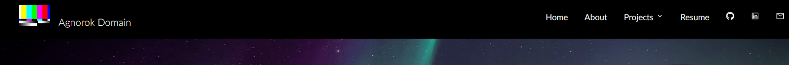
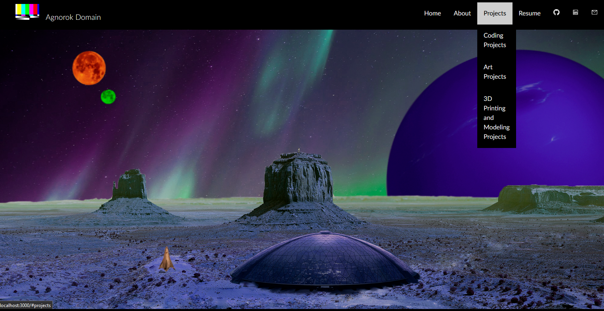
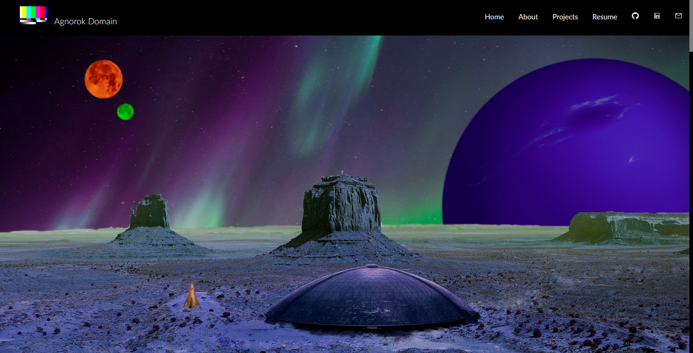
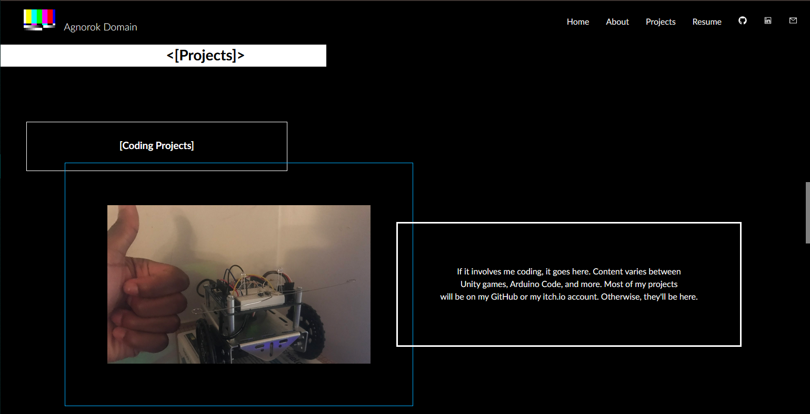
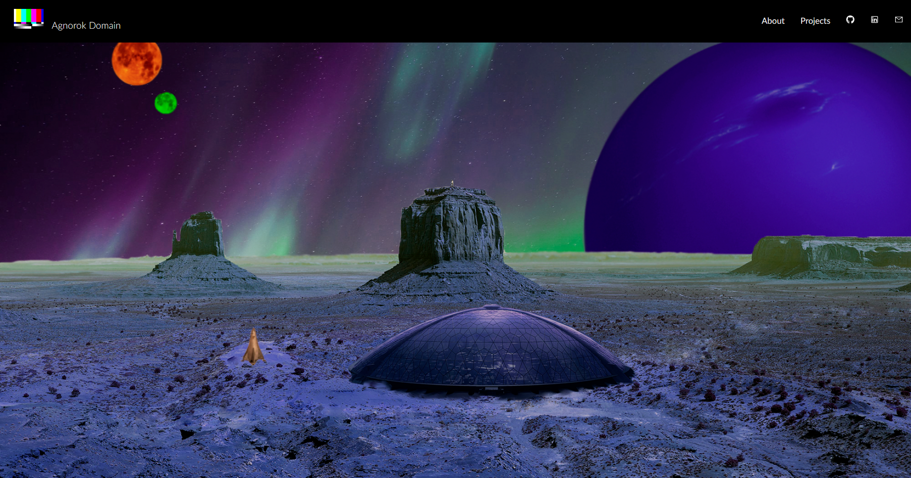

# Preview Update v0.5
implemented React Router for seamless page switching, this is how the barebones pages look like:

pretty barren now, but it's a start

/ also made the dropdown on the navbar easier for users to see (theres an arrow for down :0)

# Preview - Update v0.3
Updated Navbar with dropdown action

Sample of the overall website style and feel, all sections have a similar feel

# Preview - Update v0.1
Navbar and image header, still working on the rest of the page

