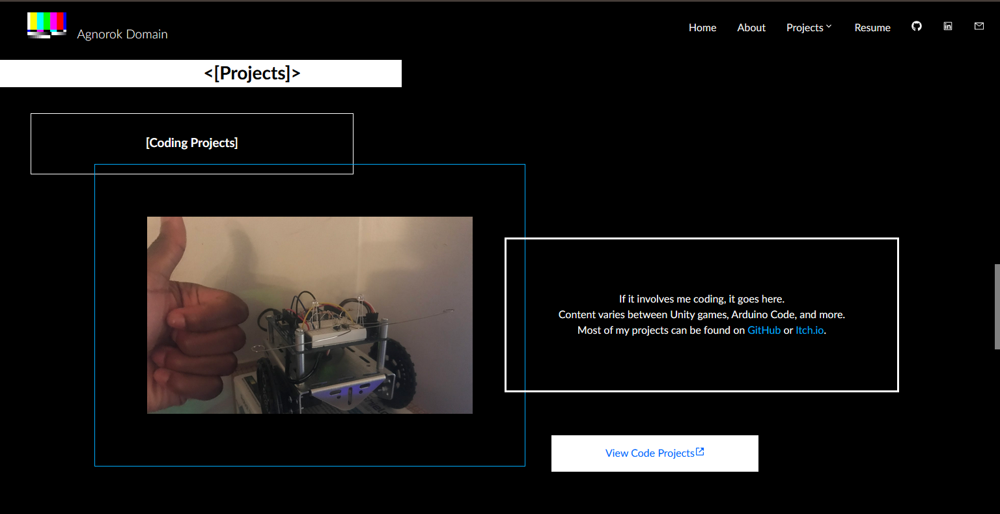
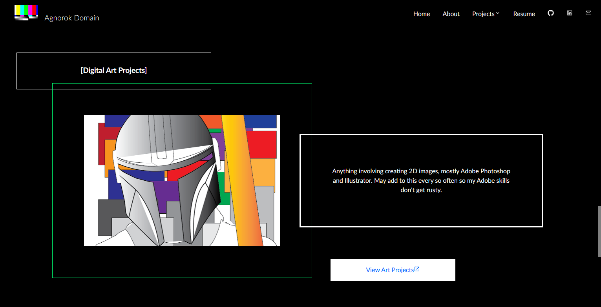
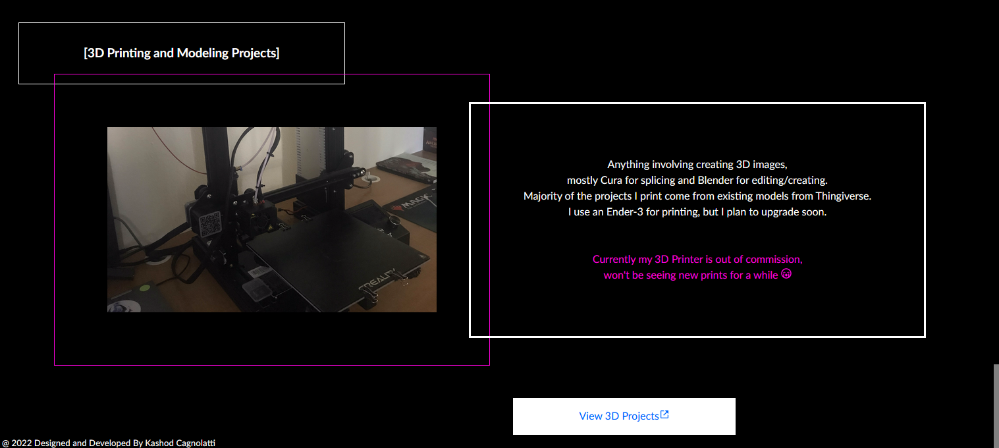
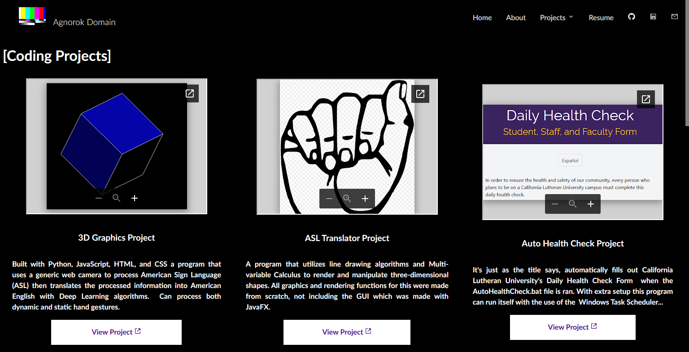
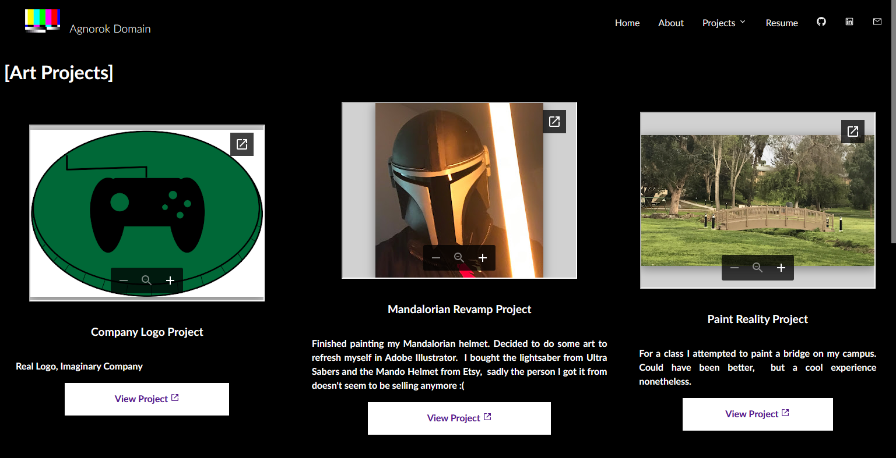
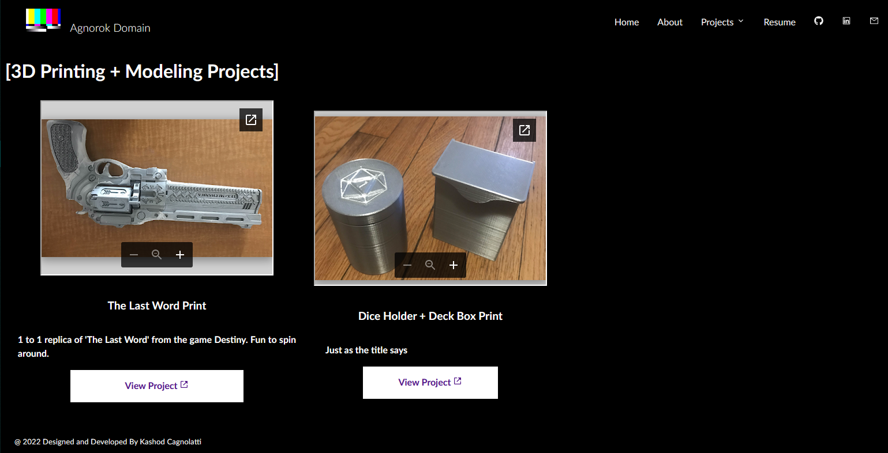

# Preview Update v0.7
Adding final details to page contents and Debugging/Testing site on different browsers and resolutions
- Added a button directing to project pages from Home/ Also added a bit of flair to the text

Next
- Cleaning Code 
- Plan to add more styling to each of the Tile cards
- Debating on making extra pages for displaying art content and 3D print images
- Update Navbar for mobile devices
- More Testing and Debugging
____________________________________________________________________________________________________
# Preview Update v0.6
Started adding content to the project pages, plan to add more detail to each of my displayed github repos (similar to this) so they can be used as standalone project pages.
The header for each feels a bit empty, may add a mini desc. for each of the sections
- Plan to add more styling to each of the Tile cards
- Debating on making extra pages for displaying art content and 3D print images
- Debugging/Test phase is almost here

____________________________________________________________________________________________________
# Preview Update v0.5
- implemented React Router for seamless page switching, this is how the barebones pages look:

pretty barren now, but it's a start

- also made the dropdown on the navbar easier for users to see (theres an arrow for down :0)

____________________________________________________________________________________________________
# Preview - Update v0.3
Updated Navbar with dropdown action

Sample of the overall website style and feel, all sections have a similar feel

____________________________________________________________________________________________________
# Preview - Update v0.1
- Navbar and image header, still working on the rest of the page

